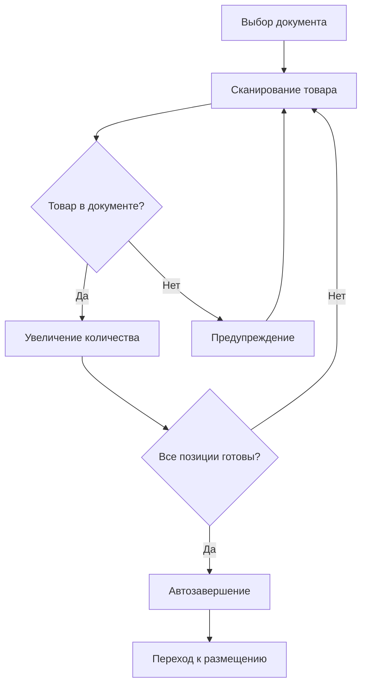

# 📦 Модуль Приёмки (Receiving)

## Описание

Модуль приёмки товаров от поставщиков. Обеспечивает контроль соответствия фактических поставок плановым значениям.

## Операции

### 1. Работа с документами

#### Список документов
- Просмотр всех документов приёмки
- Фильтрация по статусу, поставщику, дате
- Поиск по номеру, поставщику, номеру поставки
- Сортировка по дате, поставщику, статусу, номеру

#### Статусы документов
- `pending` - Ожидает (не начат)
- `in_progress` - В работе (частично выполнен)
- `completed` - Завершён

### 2. Процесс приёмки товара

#### Сканирование
- Сканирование штрихкода товара через камеру
- Ввод с клавиатуры (сканер или ручной ввод)
- Автоматическая идентификация товара

#### Учёт количества
- **Автоувеличение**: +1 при каждом сканировании
- **Быстрые кнопки**: +1, +5, +10, -1
- **Ручной ввод**: точное количество
- **По плану**: автозаполнение плановым количеством

#### Состояния строк
- 🟢 **Не начато** (pending): `fact = 0` - требует внимания
- 🔵 **В работе** (partial): `0 < fact < plan` - в процессе
- 🟡 **Перебор** (over-plan): `fact > plan` - требует подтверждения
- ⚫ **Готово** (completed): `fact = plan` - завершено

### 3. Обработка расхождений

#### Недостача
- Отображение недостающего количества
- Предупреждение при завершении документа
- Возможность завершить с недостачей

#### Излишки
- Предупреждение при превышении плана
- Подтверждение приёмки сверх плана
- Отметка в итоговом отчёте

#### Неизвестный товар
- Предупреждение при сканировании товара не из документа
- Возможность добавить как лишний (в разработке)

### 4. Завершение документа

#### Автоматическое завершение
- Срабатывает когда все позиции `fact >= plan`
- Предложение перейти к размещению

#### Ручное завершение
- Кнопка "Завершить документ"
- Показ детальной сводки:
  - Принято точно
  - Недостача (количество позиций и штук)
  - Излишки (количество позиций и штук)
- Подтверждение с расхождениями

## Архитектура

### Структура файлов

```
src/modules/receiving/
├── types.ts          # TypeScript типы
├── api.ts            # API-слой (demo/real)
├── logic.ts          # Бизнес-логика
└── components/       # Компоненты (будущее)
```

### API интерфейс

```typescript
class ReceivingAPI {
  // Получение документов с фильтрами и сортировкой
  getDocuments(filters?, sort?): Promise<ReceivingDocument[]>
  
  // Получение одного документа
  getDocument(id): Promise<ReceivingDocument | null>
  
  // Получение строк документа
  getLines(documentId): Promise<ReceivingLine[]>
  
  // Обновление количества
  updateLineQuantity(lineId, quantity): Promise<void>
  
  // Завершение документа
  completeDocument(documentId): Promise<void>
}
```

### Бизнес-логика

```typescript
// Расчёт прогресса
calculateProgress(doc): number

// Проверка расхождений
hasDiscrepancy(line): boolean
getDiscrepancyType(line): 'shortage' | 'surplus' | 'exact'

// Приоритизация
getLinePriority(line): number
sortLinesByPriority(lines): ReceivingLine[]

// Статистика
getDocumentStats(lines): DocumentStats

// Валидация
canCompleteDocument(lines): { canComplete, warnings }
```

## Рабочий процесс



## Данные

### ReceivingDocument

```typescript
{
  id: string;
  number?: string;
  status: 'pending' | 'in_progress' | 'completed';
  supplier?: string;
  deliveryNumber?: string;
  expectedDate?: number;
  createdAt: number;
  updatedAt: number;
  totalLines: number;
  completedLines: number;
}
```

### ReceivingLine

```typescript
{
  id: string;
  documentId: string;
  productId: string;
  productName: string;
  productSku?: string;
  barcode?: string;
  quantityPlan: number;
  quantityFact: number;
  status: 'pending' | 'partial' | 'completed' | 'error';
  expiryDate?: number;
  lotNumber?: string;
  receivedAt?: number;
}
```

## Offline-режим

- Все операции сохраняются локально в IndexedDB
- Очередь синхронизации для отправки на сервер
- Индикатор статуса подключения
- Автоматическая синхронизация при восстановлении связи

## Следующие шаги

После завершения приёмки товар переходит к:
- **Размещению** (Placement) - размещение в ячейках хранения
- **Подбору** (Picking) - использование в заказах
